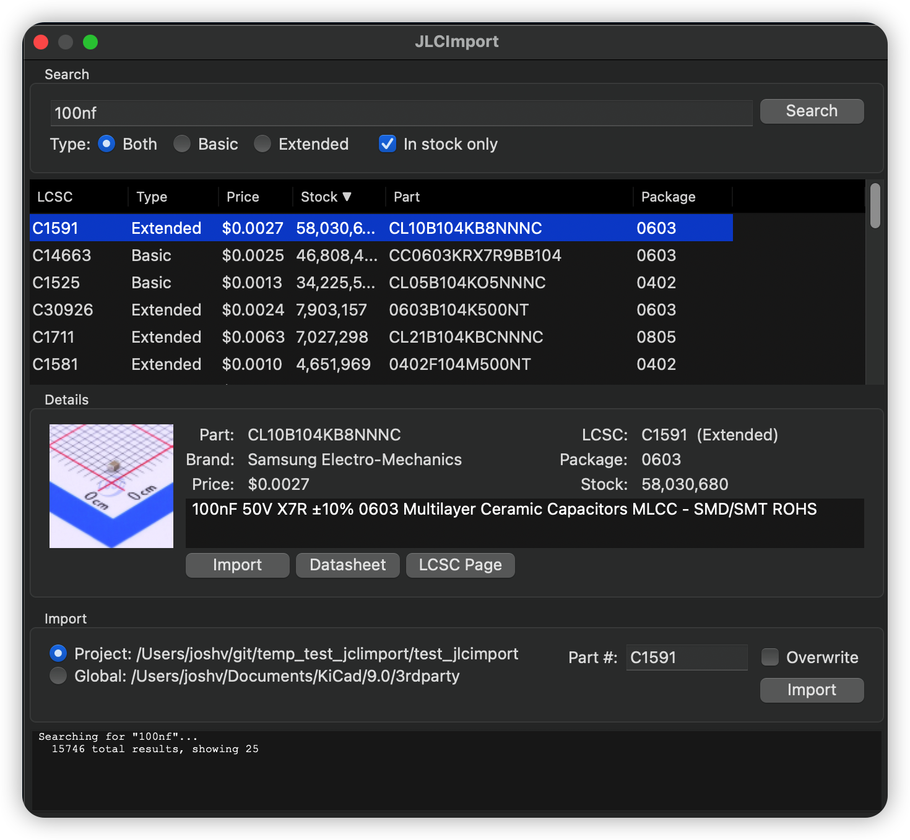
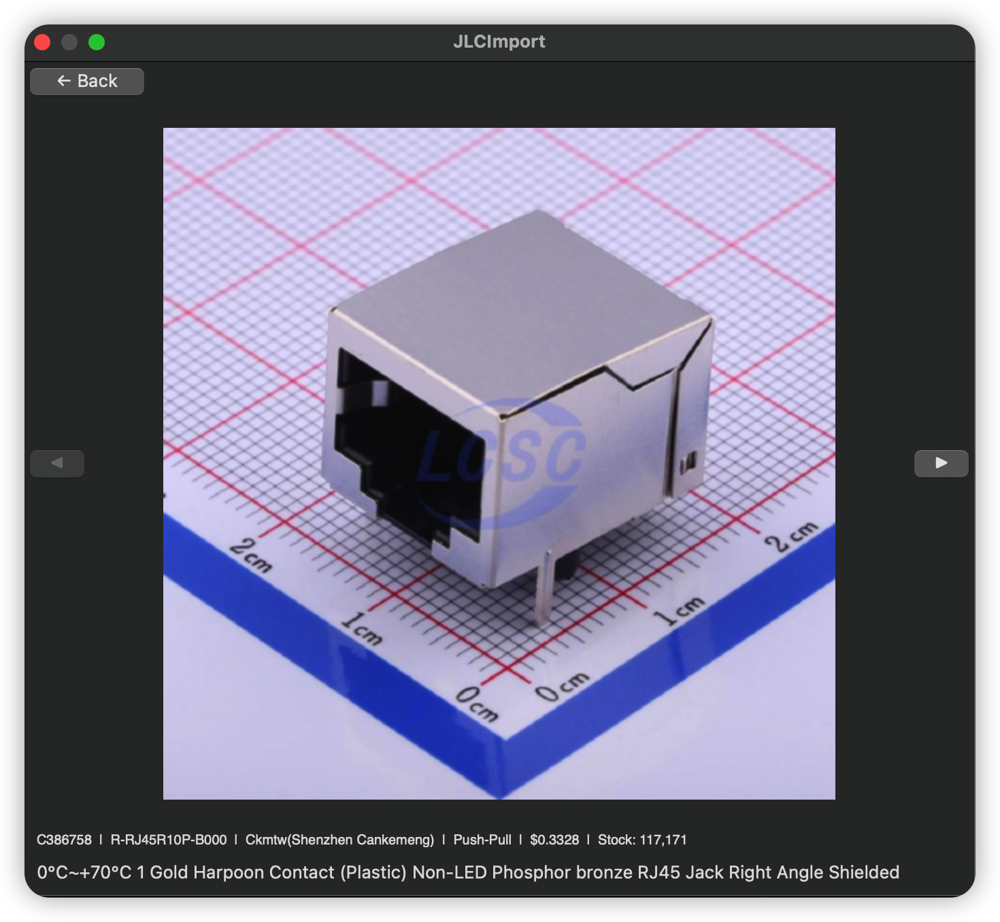
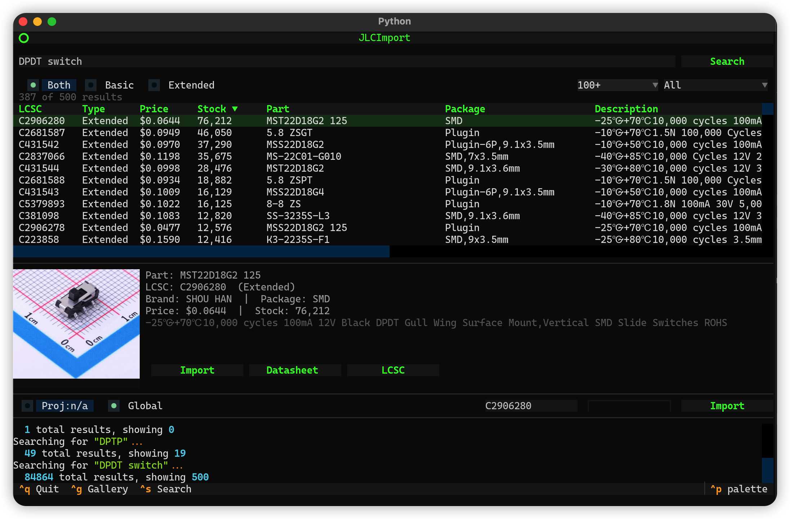

# JLCImport

A KiCad 8/9 Action Plugin that imports symbols, footprints, and 3D models directly from LCSC/JLCPCB into your KiCad project or global library.





## Features

- Search the JLCPCB parts catalog with filtering (Basic/Extended, minimum stock)
- Preview product images with full-screen gallery view
- Import symbols, footprints, and STEP/WRL 3D models
- Sortable results by price, stock, part number, description, etc.
- Checkmark (✓) indicator on parts already imported to your library
- Configurable library name (defaults to "JLCImport", persisted across sessions)
- Import to project folder or global 3rd-party library
- Append to existing KiCad libraries without conflict
- Links to datasheets and LCSC product pages
- CLI tool for scripted/batch imports
- Standalone GUI for use outside KiCad

## Installation

### Option 1: Plugin and Content Manager (recommended)

1. Go to the [Releases](https://github.com/jvanderberg/kicad_jlcimport/releases) page and download **JLCImport-vX.X.X.zip** (not the "Source code" ZIP)
2. Open KiCad and go to **Tools > Plugin and Content Manager**
3. Click **Install from File...** at the bottom of the window
4. Select the downloaded ZIP file
5. Click **Apply Pending Changes** to complete the installation

### Option 2: Manual Installation

#### Find your KiCad plugins directory

| OS | Path |
|----|------|
| macOS | `~/Documents/KiCad/<version>/scripting/plugins/` |
| Linux | `~/.local/share/kicad/<version>/scripting/plugins/` |
| Windows | `%APPDATA%\kicad\<version>\scripting\plugins\` |

> Replace `<version>` with `8.0` or `9.0` depending on your KiCad installation.

#### Symlink (recommended for development)

```bash
ln -s /path/to/kicad_jlcimport/src/kicad_jlcimport <plugins-dir>/kicad_jlcimport
```

#### Copy

```bash
cp -r /path/to/kicad_jlcimport/src/kicad_jlcimport <plugins-dir>/kicad_jlcimport
```

### Activate

1. Restart KiCad
2. Open the PCB Editor
3. The plugin appears in **Tools > External Plugins > JLCImport**

## Usage

### Plugin Dialog

1. Open the PCB Editor and launch **JLCImport** from the External Plugins menu
2. Type a search query (e.g. "100nF 0402", "ESP32", "RP2350")
3. Filter by type (Basic/Extended/Both) and minimum stock level
4. Parts already in your library are marked with ✓ in the results list
5. Click a result to see details, product image, and description
6. Click the thumbnail to open the full-screen gallery with arrow navigation
7. Choose a destination:
   - **Project** — saves to the current board's directory
   - **Global** — saves to KiCad's 3rd-party library folder
8. Optionally change the **Library** name (defaults to "JLCImport", remembered across sessions). You can point this at an existing library to append to it.
9. Click **Import** to download and save the symbol, footprint, and 3D model

> **Note:** If library tables (`sym-lib-table` / `fp-lib-table`) are newly created, reopen the project for them to take effect.

### Pre-built Binaries

Standalone binaries for the CLI, TUI, and GUI are available on the [Releases](https://github.com/jvanderberg/kicad_jlcimport/releases) page — no Python installation required.

**macOS:** After extracting, remove the quarantine attribute before running:

```bash
xattr -cr jlcimport-cli/
xattr -cr jlcimport-tui/
xattr -cr jlcimport-gui/
```

Without this, macOS Gatekeeper will block the unsigned binaries.

### Development setup

```bash
source install.sh        # macOS/Linux
. .\install.ps1          # Windows PowerShell
```

On first run this creates a virtual environment and installs dev dependencies. On subsequent runs it just activates the venv. Run it each time you open a new terminal for this project.

This installs `jlcimport-cli`, `jlcimport-tui`, and `jlcimport-gui` as commands.

### CLI

The CLI tool can be used outside KiCad for testing or scripted imports:

```bash
# Search (default: --min-stock 1, only shows parts in stock)
jlcimport-cli search "100nF 0402" -t basic
jlcimport-cli search "ESP32" -n 20 --min-stock 100

# Search with CSV output
jlcimport-cli search "RP2350" --csv > parts.csv

# Import (prints generated output)
jlcimport-cli import C427602 --show both

# Import to directory (saves .kicad_sym, .kicad_mod, and 3D models)
jlcimport-cli import C427602 -o ./output

# Import using a custom library name
jlcimport-cli import C427602 -o ./output --lib-name MyParts

# Import directly into a KiCad project (updates sym-lib-table / fp-lib-table)
jlcimport-cli import C427602 -p /path/to/kicad/project

# Import into KiCad's global 3rd-party library (updates global lib tables)
jlcimport-cli import C427602 --global

# Import targeting KiCad 8 format and library paths
jlcimport-cli import C427602 --global --kicad-version 8

# Re-import a component, overwriting existing symbol/footprint/3D models
jlcimport-cli import C427602 -p /path/to/kicad/project --overwrite
```

### Standalone GUI

Run the wxPython GUI outside of KiCad — useful for importing parts before starting a project or when KiCad isn't available.

```bash
# Install GUI dependencies (inside venv)
pip install -e '.[gui]'

# Run
jlcimport-gui

# Or with a project directory
jlcimport-gui -p /path/to/kicad/project

# Global library only (skip directory picker)
jlcimport-gui --global

# Target KiCad 8 format and library paths
jlcimport-gui --kicad-version 8
```

When run without arguments, a directory picker dialog lets you select your KiCad project folder. Cancel to use the global library only. The KiCad version can also be changed from the dropdown in the import section.

### TUI

A terminal-based interface with image preview support (Sixel, Kitty, iTerm2, or halfcell fallback).



```bash
# Install TUI dependencies (inside venv, requires Python 3.10+)
pip install -e '.[tui]'

# Run with a project directory
jlcimport-tui -p /path/to/kicad/project

# Run without project (global library only)
jlcimport-tui

# Target KiCad 8 format and library paths
jlcimport-tui --kicad-version 8
```

Features:
- Search with sortable columns (click headers to sort)
- Filter by type (Basic/Extended) and package
- Thumbnail preview with loading skeleton animation
- Click thumbnail or press `Ctrl+G` to open full-screen gallery
- Gallery navigation with arrow keys, `Escape` to return
- Configurable library name (shared with the plugin)
- Import directly from detail view or import section
- Links to datasheets and LCSC product pages

## Configuration

Settings are stored in `jlcimport.json` in your KiCad config directory:

| OS | Path |
|----|------|
| macOS | `~/Library/Preferences/kicad/jlcimport.json` |
| Linux | `~/.config/kicad/jlcimport.json` |
| Windows | `%APPDATA%\kicad\jlcimport.json` |

Currently stores the library name preference. Shared between the plugin, TUI, and CLI.

## How It Works

JLCImport fetches component data from the EasyEDA/LCSC API, parses the proprietary shape format, and converts it to KiCad file formats:

- **Symbols** → `.kicad_sym` (version 20231120 for KiCad 8, 20241209 for KiCad 9)
- **Footprints** → `.kicad_mod` (version 20240108 for KiCad 8, 20241229 for KiCad 9)
- **3D Models** → `.step` and `.wrl`

The plugin automatically creates and updates `sym-lib-table` and `fp-lib-table` entries so imported parts are immediately available in your schematic and PCB editors.

For a detailed look at the architecture, data flow, module responsibilities, and external APIs, see the [Architecture Documentation](docs/architecture.md).

### Visual Comparison

A [visual comparison](https://jvanderberg.github.io/kicad_jlcimport/) of EasyEDA source renderings vs KiCad conversion output is published on each release, covering 100 parts across ICs, passives, LEDs, transistors, and connectors.

The footprint conversion is generally quite good, though you may occasionally find small differences. The 3D model placement uses heuristics to replicate EasyEDA's undocumented behavior and works well for most parts, but some edge cases may need manual tweaking. Note that some parts are actually wrong in EasyEDA itself, which we can't automatically fix.

## Requirements

- KiCad 8.0+
- Python 3 (bundled with KiCad)
- Internet connection

The plugin requires no additional Python packages — it uses only the standard library and `wx` (both bundled with KiCad). The standalone GUI requires wxPython (see [Standalone GUI](#standalone-gui) above). The TUI requires Python 3.10+ and additional packages (see [TUI](#tui) above).

## Troubleshooting

### No symbol preview on Windows (KiCad 9)

KiCad 9.x on Windows ships without a compiled `wx.svg._nanosvg` module, which
prevents the plugin from rendering symbol preview images. To fix this:

1. Close KiCad.
2. Copy [`fixes/_nanosvg.pyd`](fixes/_nanosvg.pyd) into your KiCad installation's
   `wx\svg` folder:
   ```
   C:\Program Files\KiCad\<version>\bin\Lib\site-packages\wx\svg\_nanosvg.pyd
   ```
   Replace `<version>` with your KiCad version (e.g. `9.0`). You may need to
   run the copy as Administrator.
3. Restart KiCad.

See [`fixes/README.md`](fixes/README.md) for more details.

## License

See [LICENSE](LICENSE) for details.
