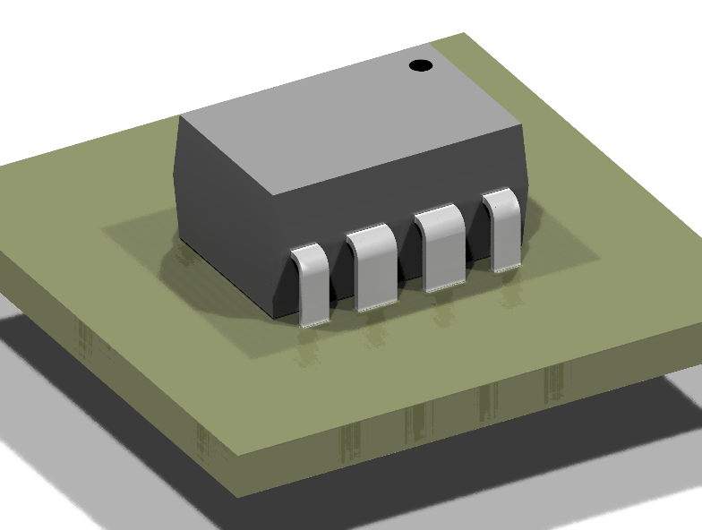

# 3D Model Snapshot Investigation - FINDINGS

## Question
Can KiCad export snapshots from its 3D view for use in the visual comparison tool?

## Answer
**YES!** ✅ KiCad can render 3D model snapshots via `kicad-cli pcb render`.

## Summary

After testing multiple camera angles and zoom levels, the optimal settings are:
- **Rotation:** `120,180,30` - Shows component from oblique angle, correctly oriented
- **Zoom:** `1.2` - Good balance between showing detail and full component
- **Quality:** `high` - Better rendering, acceptable performance (~0.7s/render)
- **Background:** `transparent` - Works well in HTML pages
- **Floor:** Enabled - Adds shadows for depth perception

## How It Works

KiCad doesn't have a standalone 3D model viewer CLI, but **`kicad-cli pcb render` can render 3D models** when they're referenced in a footprint on a PCB.

### Workflow

1. **Create minimal footprint** with 3D model reference:
```
(footprint "PartName"
  ...
  (model "/path/to/model.wrl"
    (offset (xyz 0 0 2.285))
    (scale (xyz 1 1 1))
    (rotate (xyz 0 0 0))
  )
)
```

2. **Embed in minimal PCB**:
```
(kicad_pcb
  ...
  (footprint "PartName" ...)  # footprint with 3D model
)
```

3. **Render with kicad-cli**:
```bash
kicad-cli pcb render input.kicad_pcb \
  --output output.png \
  --rotate 120,180,30 \       # oblique view from above
  --width 800 \
  --height 600 \
  --background transparent \
  --quality high \
  --floor \                   # shadows
  --zoom 1.2
```

### Test Results

**Tested with:** C5206 (DIP-8 package)
- **Input:** `testdata/C5206_model.obj` → converted to VRML
- **Output:** `docs/3d-render-final.png` (RGBA, transparent background)
- **Render time:** ~0.7s
- **Result:** ✅ Successfully rendered 3D model

**Final settings:**
- **Rotation:** `120,180,30` (oblique view from above)
- **Zoom:** `1.2`
- **Quality:** `high`
- **Background:** `transparent`
- **Floor:** enabled (for shadows)



## Key Capabilities

### View Angles
- **Predefined sides:** top, bottom, left, right, front, back
- **Custom rotation:** `--rotate X,Y,Z` (e.g., `30,0,30` for isometric)
- **Pan/pivot:** Adjust camera position

### Rendering Options
- **Size:** `--width` / `--height` (default: 1600x900)
- **Quality:** basic, high, user, job_settings
- **Background:** transparent, opaque, default
- **Floor/shadows:** `--floor` flag
- **Zoom:** `--zoom 1.5` (adjustable)
- **Lighting:** Customize top/bottom/side/camera lights

### Output Formats
- PNG (with transparency support)
- JPEG

## Implementation for Visual Comparison Tool

### Approach

Since KiCad **can** render 3D snapshots, we should:

1. **Download 3D models** (.wrl from OBJ conversion, or .step if available)
2. **Create minimal PCB** with footprint containing the 3D model
3. **Render multiple views:**
   - Top view (`--side top`)
   - Isometric view (`--rotate 30,0,30`)
4. **Embed PNGs** in HTML comparison page

### EasyEDA 3D Preview

**Problem:** EasyEDA doesn't provide pre-rendered 3D images

**Options:**
1. **Show KiCad-only** (simplest, recommended for MVP)
2. **Render EasyEDA OBJ ourselves** (complex, requires 3D rendering library)
3. **Screenshot EasyEDA web viewer** (fragile, not recommended)

**Recommendation:** Start with option 1 - show only KiCad 3D renders in the comparison tool.

## Performance Considerations

**Render time per view:** ~0.8s (high quality)
- 100 parts × 2 views × 0.8s = **~3 minutes**

**Optimizations:**
- Use `--quality basic` for faster rendering (~0.3s/view)
- Parallel rendering with multiprocessing
- Cache renders (check if model changed)

## Next Steps

1. ✅ **Verified KiCad can render 3D models**
2. ⏭ Implement in `tools/compare_part.py`:
   - Add 3D model download
   - Create minimal PCB with 3D model
   - Render top + isometric views
   - Embed in HTML
3. ⏭ Test with multiple parts
4. ⏭ Add to CI/CD workflow
5. ⏭ Update documentation

## Example Code

See `test_3d_render.py` for full working example that:
- Loads C5206 OBJ model
- Converts to VRML
- Creates minimal PCB
- Renders 3D snapshot with kicad-cli
- Opens result in viewer

**Final command:**
```bash
kicad-cli pcb render /tmp/test_3d.kicad_pcb \
  --output /tmp/test_3d_render.png \
  --rotate 120,180,30 \
  --width 800 \
  --height 600 \
  --background transparent \
  --quality high \
  --floor \
  --zoom 1.2
```

**Result:** ✅ PNG with transparent background showing correctly-oriented 3D-rendered DIP-8 package from oblique angle
